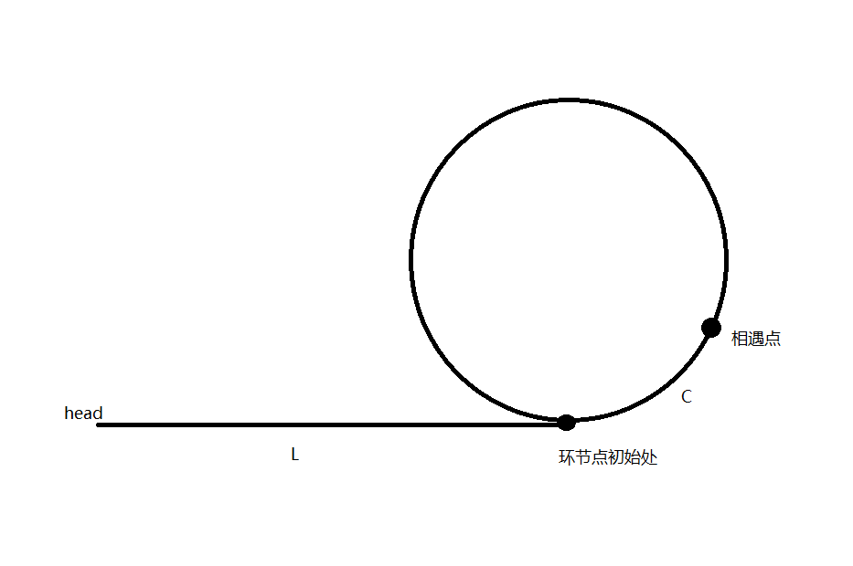

## 链表
链表由一系列不必须在内存中相连的结构组成。每一个结构均含有表元素和只想包含该元素后继元素的指针，称之为*Next*指针。最后一个单元的Next指针指向NULL；
```go
type ListNode struct {
     Val int
    Next *ListNode
}
 ```
 链表的delete例程 注意链表中的元素可能重复
 ```go
 func removeElements(head *ListNode, val int) *ListNode {
	sentry := new(ListNode)
	sentry.Next = head
	p := sentry
	for p.Next != nil {
		if p.Next.Val == val {
			tmp := p.Next
            p.Next = tmp.Next
            //注意不要着急p=p.Next,避免元素连续出现导致跳过
		} else {
			p = p.Next
		}
	}
	return sentry.Next
}
```
解法就是借用<font color=yellow>哨兵节点</font>sentry，通过哨兵节点充当伪头节点，使得链表从头节点开始多次出现所需要删除结点的情况变得简单

对于一个链表的插入
```
 A1——>A2------->A3——A4
       |       |
       |->X————>
```

* 查找双链表的第一个公共结点
双指针法，即“无论天涯海角，我会追随你走过的路”
通过消除长度差，l1走到头走另一个链表，l2走到头走另一个链表,如果相交l1==l2,如果不相交，l1，l2都为nil
```go
func getIntersectionNode(headA, headB *ListNode) *ListNode {
	if headA == nil || headB == nil {
		return nil
	}
	l1, l2 := headA, headB
	for l1 != l2 {
		if l1 == nil {
			l1 = headB
		} else {
			l1 = l1.Next
		}
		if l2 == nil {
			l2 = headA
		} else {
			l2 = l2.Next
		}
	}
	return l1
}
```

* 链表反转
1. 双指针
   双指针即通过一个前指针一个后指针遍历链表的同时进行反转
```go
func reverseList(head *ListNode) *ListNode {
   var f,l *ListNode
   l,f=nil,head
   for f!=nil{
       t:=f.Next
       f.Next=l
       l=f
       f=t 
   }
   return l
}
```
2. 递归
```go
func reverseList(head *ListNode) *ListNode {
   if head==nil||head.Next==nil{
       return head
   }
   ret:=reverseList(head.Next)
   head.Next.Next=head
   head.Next=nil
   return ret
}
```

* 链表求环,返回开头节点
```go
func detectCycle(head *ListNode) *ListNode {
	fast, slow := head, head
	if head == nil {
		return nil
	}
	for fast != nil {
		//避免越界
		if fast.Next == nil || slow.Next == nil {
			return nil
		}
		fast = fast.Next.Next
		slow = slow.Next
		if fast == slow {
			break
		}
	}
	//避免无环时导致越界
	if fast == nil || slow == nil {
		return nil
	}
	slow = head
	for slow != fast {
		slow = slow.Next
		fast = fast.Next
	}
	return fast
}

```
讲解：对于一个链表假设有环，假设头结点到环节点处距离为L，环节点到第一次相遇处为c，环周长为T



可以得到以下等式

S1=L+c+N*T (N表示快指针在环路上转的圈数 N>=1)

S2=L+c+n*T(n表示慢指针在环路上转的圈数 n>=0)

假设k为快慢指针的速度比 那么S1=k*S2  带入上述两式

得到 L=(N-n * k)/(k-1)T-c=(T-c)+((N-n * k)/(k-1)-1)*T

后式的值为>=0的整数，也就是说L的长度是T-c长度加上e倍的环周长

也就是当速度相同的两个指针一个在head处一个在c处他们同时出发一定相遇在环节点处


