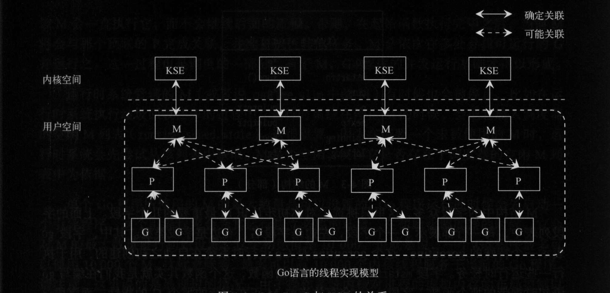
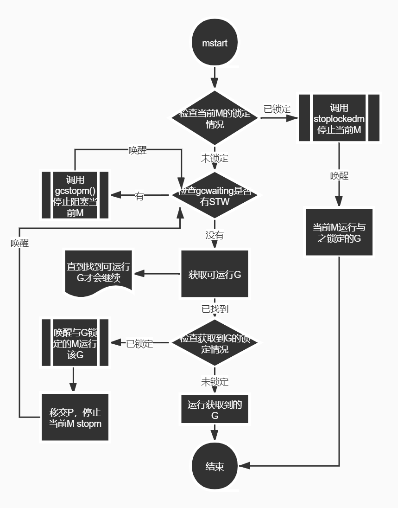

#### 操作系统的线程（thread）和进程（process）

当操作系统运行一个应用程序的时候，os会为这个程序启动一个进程。可以说这个进程是一个包含了应用程序在运行中需要用到和维护的各种资源的容器
* 进程是具有一定独立功能的程序关于某个数据集合上的一次运行活动,进程是系统进行资源分配和调度的一个独立单位。每个进程都有自己的独立内存空间，不同进程通过进程间通信来通信。由于进程比较重量，占据独立的内存，所以上下文进程间的切换开销（栈、寄存器、虚拟内存、文件句柄等）比较大，但相对比较稳定安全

* 线程 线程是进程的一个实体,是CPU调度和分派的基本单位,它是比进程更小的能独立运行的基本单位.线程自己基本上不拥有系统资源,只拥有一点在运行中必不可少的资源(如程序计数器,一组寄存器和栈),但是它可与同属一个进程的其他的线程共享进程所拥有的全部资源。线程间通信主要通过共享内存，上下文切换很快，资源开销较少，但相比进程不够稳定容易丢失数据。

* 协程是一种用户态的轻量级线程，协程的调度完全由用户控制。协程拥有自己的寄存器上下文和栈。协程调度切换时，将寄存器上下文和栈保存到其他地方，在切回来的时候，恢复先前保存的寄存器上下文和栈，直接操作栈则基本没有内核切换的开销，可以不加锁的访问全局变量，所以上下文的切换非常快。

#### 多进程编程

Linux中支持IPC的方法有很多种。从处理机制看 可分为基于通信的IPC方法、基于信号的IPC方法、基于同步的IPC方法。
其中，基于通信的IPC方法又分为以数据传送为手段的IPC方法和一共享内存为手段的IPC方法，前者包含了管道和消息队列。
管道可以用来传送字节流、消息队列可以用来传送结构化的消息对象。以共享内存为手段的IPC方法主要以共享内存区为代表，他是最快的一种IPC方法。
基于信号的IPC方法就是我们常说的os的信号机制，他是惟一异步的IPC方法。

*Go中支持IPC的方法有管道、信号、和socket*

* 进程的状态

1. 可运行状态 R
2. 可中断的睡眠状态 S
3. 不可中断的睡眠状态 D
4. 暂停状态或者跟踪状态 T
5. 僵尸状态 Z  处于此状态的进程即将结束运行 该进程占用的绝大多数资源也已经回收 ，不过还有一些信息未删除，比如退出码以及一些统计信息。之所以保留
   这些信息，主要是考虑到该进程的父进程可能需要他们。
6. 退出状态 X

### 线程的实现模型

KSE 内核调度实体 顾名思义 内核调度实体就是可以被内核的调度器调度的对象。也成为内核级线程，是os内核调度的最小调度单元。

* 用户级线程模型 多对一
* 内核级线程模型 一对一
* 两级线程模型  多对多

#### 线程调度模型GMP

M 一个M代表一个内核线程
P 一个P代表执行一个Go代码片段所必须的资源（上下文资源）
G 一个G代表一个Go代码片段 。

一个G的执行需要P和M的支持。一个M在和一个P关联之后，就形成一个G的有效的运行环境。M与KSE之间总是一对一的关系，一个M在其生命周期内，会且仅会与一个KSE产生关联。M与P见也总是一对一的关系，而P与G之间则是一对多的关系。而M与G之间也会建立关联，因为一个G终归是由一个M负责运行。



#### M
##### M的结构
一个M代表一个内核线程，M的结构如下：
```go
type m struct {

   g0      *g               // OS在启动之初为M分配的一个特殊的G
   mstartfn      func()     // m的启动函数
   curg          *g         // 当前运行的g的指针
   p             puintptr   // 当前m相关联的p
   nextp         puintptr   // 临时存放p
   spinning      bool       // 自旋状态表示当前M是否在寻找可运行G 
   park          note       // 休眠锁
   schedlink     muintptr   // 链表
   ...
}
```
##### M的创建
```go
// Create a new m. It will start off with a call to fn, or else the scheduler.
// fn needs to be static and not a heap allocated closure.
// May run with m.p==nil, so write barriers are not allowed.
//go:nowritebarrierrec
//创建一个新的m。它将以对fn或调度程序的调用开始。
func newm(fn func(), _p_ *p) {
   //创建一个M对象
   mp := allocm(_p_, fn)
   //设置当前M的下一个P为_p_
   mp.nextp.set(_p_)
   ...
   newm1(mp)
}

func newm1(mp *m) {
   if iscgo {
      //cgo的一些处理
      ...
   }
   //创建系统线程
   execLock.rlock() // Prevent process clone.
	newosproc(mp)
	execLock.runlock()
}
```
在os_linux.go中
```go
func newosproc(mp *m) {
   //g0的栈内存地址
   stk := unsafe.Pointer(mp.g0.stack.hi)
   ...
   sigprocmask(_SIG_SETMASK, &sigset_all, &oset)
   //系统调用
	ret := clone(cloneFlags, stk, unsafe.Pointer(mp), unsafe.Pointer(mp.g0), unsafe.Pointer(funcPC(mstart)))
   sigprocmask(_SIG_SETMASK, &oset, nil)
   ...
}
```
关于m对象的创建
```go
func allocm(_p_ *p, fn func()) *m {
   ...
   mp := new(m)
	mp.mstartfn = fn
   mcommoninit(mp)
   //创建g0
   // In case of cgo or Solaris or illumos or Darwin, pthread_create will make us a stack.
	// Windows and Plan 9 will layout sched stack on OS stack.
	if iscgo || GOOS == "solaris" || GOOS == "illumos" || GOOS == "windows" || GOOS == "plan9" || GOOS == "darwin" {
      //分配一个新的g
		mp.g0 = malg(-1)
	} else {
		mp.g0 = malg(8192 * sys.StackGuardMultiplier)
	}
	mp.g0.m = mp

	if _p_ == _g_.m.p.ptr() {
		releasep()
	}
	releasem(_g_.m)

	return mp
}
```
##### 与M有关的结构
| 名称            | 介绍                                                                                            |
| --------------- | ----------------------------------------------------------------------------------------------- |
| 全局M列表       | M在创建之处，会被加入到全局的M列表中，运行时系统会为这个M专门创建一个新的内核线程并与之相关联。 |
| 调度器空闲M列表 | M在系统停止M的时候，会被放入调度器的空闲M列表                                                   |

```go
var  allm       *m  //全局M列表
```
调度器拥有的空闲M列表后续会讲

* 什么时候创建新的M？
  当M因为系统调用而阻塞的时候，系统会把M和与之关联的P分离开来。这时，如果这个P的可运行队列中还有未被运行的G，那么系统会找到一个空闲的M或者创建一个新的M，并与该P关联以满足这些G的运行需要。
* m的状态
  m其实是有个自旋状态spinning，是否需要唤醒或者创建新的M取决于当前自旋中M的数量。
#### P
P是G能够在M中运行的关键。
关于P的一些数据结构：
| 名称            | 说明                                                                                                                                                                                      |
| --------------- | ----------------------------------------------------------------------------------------------------------------------------------------------------------------------------------------- |
| 全局P列表       | 包含了当前运行时系统创建的所有P。                                                                                                                                                         |
| 调度器空闲P列表 | 当一个P不在于任何M相关联，运行时系统就会把它放入该列表，而当运行时系统需要一个空闲P关联某个M时，会从该列表取出一个；<font color=red>*P进入空闲列表的前提是他的可运行G列表必须为空*</font> |

*状态*
1. Pidle 表明当前P未与任何M存在关联
2. Prunning 表明当前P正在与某个M关联
3. Psyscall 表明当前P中运行的G正在进行系统调用
4. Pgcstop 运行时系统需要停止调度
5. Pdead 表明当前P已经不会再被使用

P自带的一些数据结构：

| 名称        | 说明                                                                                                                                                                                   |
| ----------- | -------------------------------------------------------------------------------------------------------------------------------------------------------------------------------------- |
| 可运行G队列 | 一个G被启用后，会先被追加到某个P的可运行G队列中，运行时系统会把P中的可运行G全部取出，并放入调度器的可运行G队列中，被转移的G会在以后经由调度再次放入某个P的可运行G队列。                |
| 自由G链表   | 这个列表包含了一些已经完成的G，当一个go语句欲启动一个G的时候，系统会试图从相应P的自由G队列获取一个G来封装这个fn，仅当获取不到这样一个G的时候才会创建一个新的G，具体可以看下文go func() |
```go
type p struct {
   ...
   runqhead uint32
	runqtail uint32
   runq     [256]guintptr  //P的可运行G队列
   runnext guintptr        //优先执行
   //自由G链表
   gFree struct {
		gList
		n int32
   }
   
  ...
}

```
##### P的创建 

在调度器初始化的时候，会调整P的数量，这个时候所有的P都是调用procresize新建的，除了分配给当前主线程外，其余的P都被放入全局P列表中。
procresize默认只有调度器初始化函数schedinit和startTheWorld会调用。后文会讲到调度器初始化，而startTheWorld会激活全部由本地任务的P对象。

```go
func procresize(nprocs int32) *p {
   //gomaxprocs=len(allp)
   old := gomaxprocs
   ...
   //新增P
   for i := old; i < nprocs; i++ {
		pp := allp[i]
		if pp == nil {
			pp = new(p)
      }
      //初始化P分配cache
      pp.init(i)
      //保存到allp
		atomicstorep(unsafe.Pointer(&allp[i]), unsafe.Pointer(pp))
   }
   ...
   _g_ := getg()
	if _g_.m.p != 0 && _g_.m.p.ptr().id < nprocs {
		// 继续使用当前P
		_g_.m.p.ptr().status = _Prunning
		_g_.m.p.ptr().mcache.prepareForSweep()
	} else {
		// 释放当前P，获取allp[0]。
		
		if _g_.m.p != 0 {
			...
			_g_.m.p.ptr().m = 0
		}
		_g_.m.p = 0
		p := allp[0]
		p.m = 0
		p.status = _Pidle
		acquirep(p)
		...
	}
   //从未使用的P中释放资源
   for i := nprocs; i < old; i++ {
		p := allp[i]
		p.destroy()
      //无法释放P本身，因为它可以被syscall中的M引用
   }
   //将没有本地任务的P放到空闲链表
   var runnablePs *p
	for i := nprocs - 1; i >= 0; i-- {
      p := allp[i]
      //确保不是当前正在使用的P
		if _g_.m.p.ptr() == p {
			continue
		}
		p.status = _Pidle
		if runqempty(p) {
         //放入调度器空闲P链表
			pidleput(p)
		} else {
         //由本地任务，构建链表
			p.m.set(mget())
			p.link.set(runnablePs)
			runnablePs = p
		}
	}
   ...
   //返回由本地任务的P
	return runnablePs

}
```

```go
func (pp *p) init(id int32) {
   pp.id = id
	pp.status = _Pgcstop
   pp.sudogcache = pp.sudogbuf[:0]
   ...
   //为P分配cache对象
   if pp.mcache == nil {
		if id == 0 {
			if mcache0 == nil {
				throw("missing mcache?")
			}
			// Use the bootstrap mcache0. Only one P will get
			// mcache0: the one with ID 0.
			pp.mcache = mcache0
		} else {
         //创建cache
			pp.mcache = allocmcache()
		}
   }
   ...
}
```
可以看到P创建之初的状态是Pgstop，在接下来的初始化之后，系统会将其状态设置为Pidle

```go
func (pp *p) destroy() {
   //将本地任务转移到全局队列
   for pp.runqhead != pp.runqtail {
      //从本地队列尾部弹出
      pp.runqtail--
      gp := pp.runq[pp.runqtail%uint32(len(pp.runq))].ptr()
      //推到全局队列头部
      globrunqputhead(gp)
   }
   ...
   //释放当前P绑定的cache
   freemcache(pp.mcache)
   pp.mcache = nil
   //将当前P的G复用链转移到全局
   gfpurge(pp)
   ...
   pp.status = _Pdead
}
```
如果P因为allp的缩小而被认为是多余的，那么这些P会被destory，其状态会被置为Pdead。

在destory中会调用gfpurge将P中自由G链表的G全部转移到调度器的自由G列表中，在这之前他的可运行G队列中的G也会转移到调度器的可运行G队列。

* 为什么P的默认数量是CPU的总核心数？
  为了尽可能提高性能，保证n核机器上同时又n个线程并行运行，提高CPU利用率。
  P的最大数量可以通过调用runtime.GOMAXPROCS设定或者运行前设置环境变量GOMAXPROCS的值。
* P和M是如何绑定的？

#### G

一个G代表一个Go例程，G的结构如下：
```go
type g struct {
   stack       stack //执行栈
   sched        gobuf  //用于保存执行现场
   goid         int64  //唯一序号
   startpc        uintptr         // pc of goroutine function
   m            *m   //当前M
   schedlink    guintptr //链表
   ...
}
```
在运行时系统接到一个newproc调用，会先检查go函数及其参数的合法性，然后试图从本地P的自由G列表和调度器的自由G列表获取可用的G，如果没有获取到，就新建一个G。新建的G会第一时间被加入到全局G列表。
随后，系统会对这个G进行一次初始化，包括关联go函数以及设置该G的状态和ID等步骤，在初始化完成后，这个G会立即被存储在本地P的runnext字段中，如果runnext字段中已存有一个G，那么这个已有G就会被踢到该P的可运行G队列末尾。如果该队列已满，那么这个G就只能追加到调度器的可运行G队列中，具体我们调度器这节会进行介绍，参考proc.go的runqputslow()

##### G的创建
```go
func malg(stacksize int32) *g {
	newg := new(g)
	if stacksize >= 0 {
		stacksize = round2(_StackSystem + stacksize)
		systemstack(func() {
			newg.stack = stackalloc(uint32(stacksize))
		})
		newg.stackguard0 = newg.stack.lo + _StackGuard
		newg.stackguard1 = ^uintptr(0)
		// Clear the bottom word of the stack. We record g
		// there on gsignal stack during VDSO on ARM and ARM64.
		*(*uintptr)(unsafe.Pointer(newg.stack.lo)) = 0
	}
	return newg
}
```
* G的状态
1. Gidle 表示当前G刚被分配 但是未能初始化
2. Grunnable 表示当前G正在可运行队列中等待运行
3. Grunning 表示当前G正在运行
4. Gsyscall 表示当前G正在执行某个系统调用
5. Gwaiting 表示当前G正在阻塞
6. Gdead 表示当前G正在闲置
7. Gcopystack 表示当前G的栈正被移动

值得一提的是进入死亡状态的G是可以被重新初始化并使用的，他们会被放入本地P或者调度器的自由G列表。
##### 与G有关的结构
| 名称              | 描述                                  |
| ----------------- | ------------------------------------- |
| 全局G列表         | 集中存放当前运行时系统中所有G的指针。 |
| 调度器可运行G队列 | 后续会详细讲解                        |
| 调度器自由G列表   | 后续会详细讲解                        |

```go
var allgs    []*g //全局G列表
```
#### 调度器
调度器主要承担OS内核之外的一部分调度任务，他有自己的数据结构
```go
type schedt struct {
   ...
   midle        muintptr //调度器空闲M链表
   pidle      puintptr   //调度器空闲P列表
   runq     gQueue      //调度器可运行g队列
   gFree struct{
      ...
   }       // 调度器自由G列表

   gcwaiting  uint32  //表示gc正在等待运行
   stopwait   int32   //需要stop但仍未stop的p的数量
	sysmonwait uint32  //停止调度期间系统监控任务是否等待
  
   ...
}
```
##### 几个重要的数据结构
| 名称                | 结构                                                                                                                                                   | 说明                    |
| ------------------- | ------------------------------------------------------------------------------------------------------------------------------------------------------ | ----------------------- |
| 调度器的空闲M列表   | type muintptr uintptr                                                                                                                                  | 存放空闲M的一个单向链表 |
| 调度器的空闲P列表   | type puintptr uintptr                                                                                                                                  | 存放空闲P的一个单向链表 |
| 调度器的可运行G队列 | type gQueue struct {<br>&emsp;head guintptr<br>&emsp;tail guintptr<br>}                                                                                | 存放可运行G的队列       |
| 调度器的自由G队列   | gFree struct {<br>&emsp;lock    mutex<br>&emsp;stack   gList // Gs with stacks<br>&emsp;noStack gList // Gs without stacks<br>&emsp;n       int32<br>} | 存放自由G的两个单向链表 |


##### 调度器初始化schedinit
proc.go
```go
func schedinit() {
   //getg是编译器函数，它会返回当前指针指向的g
   _g_ := getg()
   //调度器初始化伊始，会设置M的最大数量10000，意味着最多有10000个M能够服务于当前go程序
   sched.maxmcount = 10000
   //其他的一些初始化函数
   ...
   //初始化栈空间复用管理链表
   stackinit()
   //内存分配初始化
   mallocinit()
   //初始化当前M
   mcommoninit(_g_.m)
   ...
   //p的默认值设置为cpu核数
   procs := ncpu
	if n, ok := atoi32(gogetenv("GOMAXPROCS")); ok && n > 0 {
		procs = n
   }
   //调整P的数量 这个在上文提到过
   if procresize(procs) != nil {
		throw("unknown runnable goroutine during bootstrap")
	}
   ...
}
```
<font color=yellow>procresize主要根据设定的p数量对全局的P列表进行重整,没有本地任务的会被放入空闲链表</font>

##### go func()
在go语句执行中，编译器会将go语句转化为对newproc的调用，这会创建一个新的G
```go
func newproc(siz int32, fn *funcval) {
   //获取第一参数地址
   argp := add(unsafe.Pointer(&fn), sys.PtrSize)
   //获取当前g的指针
   gp := getg()
   //获取调用方的PC程序计数器
   pc := getcallerpc()
   //从g0栈调用systemstack创建一个G对象
	systemstack(func() {
		newproc1(fn, argp, siz, gp, pc)
	})
}
```

```go
func newproc1(fn *funcval, argp unsafe.Pointer, narg int32, callergp *g, callerpc uintptr) {
   _g_ := getg()
   ...
   //从当前P自由G链表获取G
   _p_ := _g_.m.p.ptr()
   newg := gfget(_p_)
   //如果获取不到G，就新建一个
   if newg == nil {
		newg = malg(_StackMin)
      casgstatus(newg, _Gidle, _Gdead)
      //将新建的G加入全局G列表中
		allgadd(newg) // publishes with a g->status of Gdead so GC scanner doesn't look at uninitialized stack.
   }
   ...
   //对G的一次初始化，无论G是新建还是获取到的
   //初始化基本状态为Grunnable
   casgstatus(newg, _Gdead, _Grunnable)
   //设置唯一id等等
   ...
   //将G放入P的可运行队列
   runqput(_p_, newg, true)
   //如果有其他空闲P，则尝试唤醒某个M来执行任务
   //npidle表示当前调度器空闲P链表中P的数量
   //如果有M处于自旋等待P或者G状态 放弃
   //如果当前创建的是main goroutine，那么就还没有任务需要执行，放弃
   if atomic.Load(&sched.npidle) != 0 && atomic.Load(&sched.nmspinning) == 0 && mainStarted {
      //唤醒M，具体可看上文
      wakep()
	}
	releasem(_g_.m)
}
```

可以看下gfget是如何从当前P的自由G链表获取G的
```go
func gfget(_p_ *p) *g {
retry:
//如果当前P的自由G链表为空，尝试从调度器的自由g链表转移一部分P到本地
	if _p_.gFree.empty() && (!sched.gFree.stack.empty() || !sched.gFree.noStack.empty()) {
		lock(&sched.gFree.lock)
      // Move a batch of free Gs to the P.
      //最多转移32个
		for _p_.gFree.n < 32 {
			// Prefer Gs with stacks.
			gp := sched.gFree.stack.pop()
			if gp == nil {
				gp = sched.gFree.noStack.pop()
				if gp == nil {
					break
				}
			}
			sched.gFree.n--
			_p_.gFree.push(gp)
			_p_.gFree.n++
		}
		unlock(&sched.gFree.lock)
		goto retry
   }
   //如果当前P的自由G链表不为空，获取G对象
   gp := _p_.gFree.pop()
   if gp == nil {
		return nil
   }
   //调整P的G链表
   _p_.gFree.n--
   //后续对G stack的一些处理

   return gp  
}
```
当goroutine执行完毕，调度器会将G对象放回P的自由G链表，具体有兴趣可以参考源码
在获取到G的时候，调度器会将其放入P的可运行G队列等待执行

proc.go
```go
func runqput(_p_ *p, gp *g, next bool) {
   ...
   //将G直接保存在本地P的runnext字段中
   if next {
      retryNext:
		oldnext := _p_.runnext
		if !_p_.runnext.cas(oldnext, guintptr(unsafe.Pointer(gp))) {
			goto retryNext
      }
      	if oldnext == 0 {
			return
		}
      // Kick the old runnext out to the regular run queue.
      // 原本的next G会被放回本地队列
      gp = oldnext.ptr()
   }
   retry:
	h := atomic.LoadAcq(&_p_.runqhead) // load-acquire, synchronize with consumers
   t := _p_.runqtail
   //如果P的本地队列未满，直接放到尾部
	if t-h < uint32(len(_p_.runq)) {
		_p_.runq[t%uint32(len(_p_.runq))].set(gp)
		atomic.StoreRel(&_p_.runqtail, t+1) // store-release, makes the item available for consumption
		return
   }
   //如果已满的话 会追加到调度器的可运行G队列
	if runqputslow(_p_, gp, h, t) {
		return
	}
	// the queue is not full, now the put above must succeed
	goto retry
}

//往调度器的队列添加任务，需要加锁 所以称为slow
func runqputslow(_p_ *p, gp *g, h, t uint32) bool {
   //将本地P的一半任务转移到调度器队列中
   var batch [len(_p_.runq)/2 + 1]*g
   //调整计算过程
   ...

   var q gQueue
	q.head.set(batch[0])
	q.tail.set(batch[n])

	// Now put the batch on global queue.
   lock(&sched.lock)
   //添加到调度器的可运行G链表尾部
	globrunqputbatch(&q, int32(n+1))
   unlock(&sched.lock)
   return true
}

func globrunqputbatch(batch *gQueue, n int32) {
	sched.runq.pushBackAll(*batch)
	sched.runqsize += n
	*batch = gQueue{}
}
```
##### wakep 唤醒M执行任务

在newproc1成功创建G任务后 如果有空闲P 会尝试用wakep唤醒M执行任务 
```go
func wakep() {
   // be conservative about spinning threads
   // 被唤醒的线程需要绑定P，累加自旋计数，避免newproc1唤醒过多线程
	if !atomic.Cas(&sched.nmspinning, 0, 1) {
		return
	}
	startm(nil, true)
}

func startm(_p_ *p, spinning bool) {
   ...
   //如果没有本地P，尝试获取空闲P
   if _p_ == nil {
      //从调度器的空闲P链表获取P
		_p_ = pidleget()
		if _p_ == nil {
			unlock(&sched.lock)
			if spinning {
				// The caller incremented nmspinning, but there are no idle Ps,
				// so it's okay to just undo the increment and give up.
				if int32(atomic.Xadd(&sched.nmspinning, -1)) < 0 {
					throw("startm: negative nmspinning")
				}
			}
			return
		}
   }
   //从调度器空闲M链表获取休眠的M
   mp := mget()
   //如果没有闲置的M，newm新建
   if mp == nil {
		var fn func()
		if spinning {
			// The caller incremented nmspinning, so set m.spinning in the new M.
			fn = mspinning
		}
		newm(fn, _p_)
		return
   }
   //设置自旋状态
   mp.spinning = spinning
   //临时存放P
   mp.nextp.set(_p_)
   //唤醒M
	notewakeup(&mp.park)
}
```
M对象的创建前文中已经讲过，也就是说startm这个过程同样有两种方式，一种从调度器空闲M链表获取，一种新建一个M。进入工作状态的M，会陷入调度循环，从各种可能的场所获取G也就是下文提到的权力查找可运行的G，一旦获取到G会立即运行这个G，前提是这个G未与其他M绑定。只有找不到可运行的G或者因为系统调用阻塞等原因被剥夺P，才会进入休眠状态。

具体休眠可以查看proc.go的stopm函数。

##### 一轮调度

* 简述
在一轮调度的开始，调度器会先判断当前M是否已经锁定，如果发现当前M已经与某个G锁定，就会立即停止调度并停止当前M。一旦与他锁定的G处于可运行状态，他就唤醒并继续运行那个G。

如果当前M并未与任何G锁定，调度器会检查是否有运行时串行任务正在等待执行，如果有M会被停止并阻塞已等待运行时串行任务执行完成。一旦该串行任务执行完成，该M就会被唤醒。

调度器首先会从全局可运行G队列和本地P队列查找可运行的G，如果找不到，调度器会进入强力查找模式，如果还找不到的话，该子流程就会暂停，直到有可运行的G的出现才会继续下去。

如果找到可运行的G，调度器会判断该G未与任何M锁定的情况下，立即让当前M运行它。如果G已经锁定，那么调度器会唤醒与该G锁定的M并运行该G，停止当前M直到被唤醒。

* 分析
M执行G并发任务的起点一种是mstart，进入工作状态的M会绑定一个有效P，nextp临时持有带绑定的P对象
```go
...
//绑定有效P
if _g_.m != &m0 {
		acquirep(_g_.m.nextp.ptr())
		_g_.m.nextp = 0
   }
...
//最后进入任务调度循环
schedule()
```
进入schedule函数后，M就进入了核心调度循环。前言提到的M执行并发任务的起点的第二种方式是stopm休眠唤醒进入调度，而这种方式的M也仅是从断点状态恢复，调度器判断M未锁定的话就进入获取G的调度循环中。

```go
func schedule() {
      _g_ := getg()
      ...
      //检查M的锁定状态，如果已经锁定，停止当前M
      //直到当前M与之锁定G可运行
      if _g_.m.lockedg != 0 {
		stoplockedm()
		execute(_g_.m.lockedg.ptr(), false) // Never returns.
	}
top:
...
   pp := _g_.m.p.ptr()
	pp.preempt = false
   //gcwaiting表示当前需要停止M
	if sched.gcwaiting != 0 {
      //STW 停止阻塞当前M以等待运行时串行任务执行完成
		gcstopm()
		goto top
   }
   ...
   var gp *g
   var inheritTime bool
   ...
   //GC MarkWorker 工作模式
   //试图获取执行GC标记任务的G
   if gp == nil && gcBlackenEnabled != 0 {
		gp = gcController.findRunnableGCWorker(_g_.m.p.ptr())
		tryWakeP = tryWakeP || gp != nil
   }
   
   //每隔一段时间就去从全局队列获取G任务，确保公平性
   //否则，两个goroutines会通过不断地彼此刷新来完全占用本地运行队列。
   if gp == nil {
		// Check the global runnable queue once in a while to ensure fairness.
		// Otherwise two goroutines can completely occupy the local runqueue
		// by constantly respawning each other.
		if _g_.m.p.ptr().schedtick%61 == 0 && sched.runqsize > 0 {
			lock(&sched.lock)
			gp = globrunqget(_g_.m.p.ptr(), 1)
			unlock(&sched.lock)
		}
   }
   //试图从本地P的可运行G队列获取G
   if gp == nil {
		gp, inheritTime = runqget(_g_.m.p.ptr())
		// We can see gp != nil here even if the M is spinning,
		// if checkTimers added a local goroutine via goready.
   }
   //如果还是未找到可运行的G，进入findrunnable模式
   if gp == nil {
		gp, inheritTime = findrunnable() // blocks until work is available
	}
  //如果被标记为自旋状态，重置这个M
   if _g_.m.spinning {
		resetspinning()
   }
   ...
   //如果该G锁定，唤醒锁定的M运行该G
   if gp.lockedm != 0 {
		// Hands off own p to the locked m,
		// then blocks waiting for a new p.
		startlockedm(gp)
		goto top
	}
   //执行goroutine任务函数
   execute(gp, inheritTime)
}
```
值得注意的是如果M被标记为自旋状态，意味着还没有找到G来运行，而无论是因为找到了可运行的G又或者因为始终未找到可运行的G而需要停止M，当前M都会退出自旋状态。提一点一般情况下，运行时系统中至少会有一个自旋的M，调度器会尽量保证有一个自旋M的存在。除非没有自旋的M，调度器是不会新启用或回复一个M去运行新G的，一旦需要新启用一个M或者恢复一个M，他最初都是处于自旋状态。
整个一轮调度过程如表示：


```go
func execute(gp *g, inheritTime bool) {
   _g_ := getg()
   _g_.m.curg = gp
   gp.m = _g_.m
   ...
	casgstatus(gp, _Grunnable, _Grunning)
	gp.waitsince = 0
	gp.preempt = false
   gp.stackguard0 = gp.stack.lo + _StackGuard
   gogo(&gp.sched)
}
```
在前面流程图中把寻找可运行G的过程同意概括了，但是在程序运行中，Go是按照一定的顺序来查找G，这个在上文和程序里都有标识，值得注意的是如果本地P队列也无法找到可运行的G，程序会进入findrunnable全力查找可运行的G

```go
func findrunnable() (gp *g, inheritTime bool) {
   _g_ := getg()
   
top:
   _p_ := _g_.m.p.ptr()
   //仍然会先判断gcwaiting
	if sched.gcwaiting != 0 {
		gcstopm()
		goto top
   }
   ...
   //从本地P的可运行队列获取G
   if gp, inheritTime := runqget(_p_); gp != nil {
		return gp, inheritTime
   }
   //从调度器的可运行G队列获取
   if sched.runqsize != 0 {
		lock(&sched.lock)
		gp := globrunqget(_p_, 0)
		unlock(&sched.lock)
		if gp != nil {
			return gp, false
		}
   }
   //从I/O轮询器获取G
   if netpollinited() && atomic.Load(&netpollWaiters) > 0 && atomic.Load64(&sched.lastpoll) != 0 {
      //尝试从netpoller获取Glist
      if list := netpoll(0); !list.empty() { // non-blocking
         //表头G
         gp := list.pop()
         //将其余队列放入sched的可运行G队列
			injectglist(&list)
			casgstatus(gp, _Gwaiting, _Grunnable)
			if trace.enabled {
				traceGoUnpark(gp, 0)
			}
			return gp, false
		}
   }
   ...
   //这里进入这一步有两个条件，后文会讲
   //通过伪随机 从全局P队列的P的可运行G队列中偷取G
   for i := 0; i < 4; i++ {
		for enum := stealOrder.start(fastrand()); !enum.done(); enum.next() {
         ...
         stealRunNextG := i > 2
         p2 := allp[enum.position()]
         //从p2的可运行G队列中盗取一般的G到本地P的G队列
         if gp := runqsteal(_p_, p2, stealRunNextG); gp != nil {
				return gp, false
         }
         ...
         	if i > 2 && shouldStealTimers(p2) {
				tnow, w, ran := checkTimers(p2, now)
				now = tnow
				if w != 0 && (pollUntil == 0 || w < pollUntil) {
					pollUntil = w
				}
				if ran {
					//运行计时器可能已经使任意数量的G就绪，并将它们添加到P的本地运行队列中。这使runqsteal的假设无效，即总是有空间添加偷来的G。所以现在检查是否有一个本地的G要运行。
					if gp, inheritTime := runqget(_p_); gp != nil {
						return gp, inheritTime
					}
					ranTimer = true
				}
			}
      }
   }
   
   if ranTimer {
		// Running a timer may have made some goroutine ready.
		goto top
   }

   stop:
   //获取执行GC标记任务的G
   //当前是否处于GC标记阶段？本地P是否可用于GC标记任务？
   if gcBlackenEnabled != 0 && _p_.gcBgMarkWorker != 0 && gcMarkWorkAvailable(_p_) {
      _p_.gcMarkWorkerMode = gcMarkWorkerIdleMode
      //将本地P的GC标记专用G职位Grunnable
		gp := _p_.gcBgMarkWorker.ptr()
		casgstatus(gp, _Gwaiting, _Grunnable)
		if trace.enabled {
			traceGoUnpark(gp, 0)
		}
		return gp, false
   }
   
   ...
   //
   lock(&sched.lock)
   //检查GC回收状态
	if sched.gcwaiting != 0 || _p_.runSafePointFn != 0 {
		unlock(&sched.lock)
		goto top
   }
   //尝试从调度器可运行G队列获取G
	if sched.runqsize != 0 {
		gp := globrunqget(_p_, 0)
		unlock(&sched.lock)
		return gp, false
	}
	if releasep() != _p_ {
		throw("findrunnable: wrong p")
   }
   //如果找不到G，会解除本地P与当前M的关联
   //并将该P放入调度器的空闲P列表 
	pidleput(_p_)
   unlock(&sched.lock)
   ...
   //再次检查全局P列表
   //遍历全局P列表的P，并检查他们的可运行G队列
   for _, _p_ := range allpSnapshot {
		if !runqempty(_p_) {
			lock(&sched.lock)
			_p_ = pidleget()
         unlock(&sched.lock)
         //发现一个P不是空的，就从调度器pidle中取出一个P
         //判断可用后与当前M关联在一起，返回第一阶段重新搜索可运行的G
			if _p_ != nil {
				acquirep(_p_)
				if wasSpinning {
					_g_.m.spinning = true
					atomic.Xadd(&sched.nmspinning, 1)
				}
				goto top
			}
			break
		}
   }
   //再次获取GC的G
   //判断gcBlackenEnabled以及当前GC相关的全局资源是否可用
   if gcBlackenEnabled != 0 && gcMarkWorkAvailable(nil) {
      lock(&sched.lock)
      //从调度器pidle里拿出一个P
      _p_ = pidleget()
		if _p_ != nil && _p_.gcBgMarkWorker == 0 {
			pidleput(_p_)
			_p_ = nil
		}
      unlock(&sched.lock)
      //如果这个P持有GC标记，关联这个P与当前M
		if _p_ != nil {
			acquirep(_p_)
			if wasSpinning {
				_g_.m.spinning = true
				atomic.Xadd(&sched.nmspinning, 1)
			}
			// 再次执行第二阶段.
			goto stop
		}
   }
   //再次检查netpoll，先判断netpoller是否初始化，是否有I/O操作
   if netpollinited() && (atomic.Load(&netpollWaiters) > 0 || pollUntil != 0) && atomic.Xchg64(&sched.lastpoll, 0) != 0 {
      atomic.Store64(&sched.pollUntil, uint64(pollUntil))
      //尝试从netpoller获取Glist
      list := netpoll(delta)
      if faketime != 0 && list.empty() {
         stopm()
			goto top
      }
      ...
      _p_ = pidleget()
      ...
		if _p_ == nil {
			injectglist(&list)
		} else {
			acquirep(_p_)
			if !list.empty() {
				gp := list.pop()
				injectglist(&list)
				casgstatus(gp, _Gwaiting, _Grunnable)
				if trace.enabled {
					traceGoUnpark(gp, 0)
				}
				return gp, false
			}
			if wasSpinning {
				_g_.m.spinning = true
				atomic.Xadd(&sched.nmspinning, 1)
			}
			goto top
		}
   }

   //休眠M
   stopm()
	goto top
}
```
netpoller是Go为了在操作系统提供的异步I/O基础组件之上，实现自己的阻塞时I/O而编写的一个子程序。
从netpoller这里获取G，即获取那些已经接受到通知的G，它们既然已经可以进行网络读写操作了，那么调度器理应让他们转入Grunnable状态并等待运行。

* 执行从全局P列表的P中可运行G队列获取P是由先决条件的
：
  ```go
  procs := uint32(gomaxprocs)
  //如果当前处于自旋状态的M的数量的两倍大于非空闲P的数量 跳过这个步骤
  if !_g_.m.spinning && 2*atomic.Load(&sched.nmspinning) >= procs-atomic.Load(&sched.npidle) {
		goto stop
   }
	if !_g_.m.spinning {
		_g_.m.spinning = true
		atomic.Xadd(&sched.nmspinning, 1)
	}
  ```
  第一个条件是：除了当前P还有非空闲P。空闲的P的可运行G队列必定为空。也就是说如果出了本地P之外其他所有的P都是空闲的，那么就没有必要再去他们那里获取G。
  第二个条件是：当前M不处于自旋状态并且处于自旋状态M的数量大于非空闲P数量的二分之一，那么就会跳过这个阶段。仅有当前M处于自旋状态或者处于自旋状态M的数量小于非空闲P的数量的二分之一。*这主要是为了控制自旋M的数量，过多的自旋M会消耗过多CPU资源。*

  #### 特殊的g0和m0
  
  在运行时，每个M都会有一个特殊的G，一般称为M的g0。g0是一个默认8KB栈内存的G，他的栈内存地址被传给newosproc函数，作为系统线程默认的堆栈空间。在之前M创建的时候，我们看到每个M创建之初都会调用malg创建一个g0。也就是说每个g0都是运行时系统在初始化M是创建并分配给M的。

  M的g0一般用于执行调度、垃圾回收、栈管理等方面的任务。除了g0外，其他M运行的G都可以视为用户级别的G。

  除了每个M都有属于他的g0外，还存在一个runtime.g0。这个g0用于执行引导程序，它运行在Go程序拥有的第一个内核线程中，这个内核线程也被称为runtime.m0。