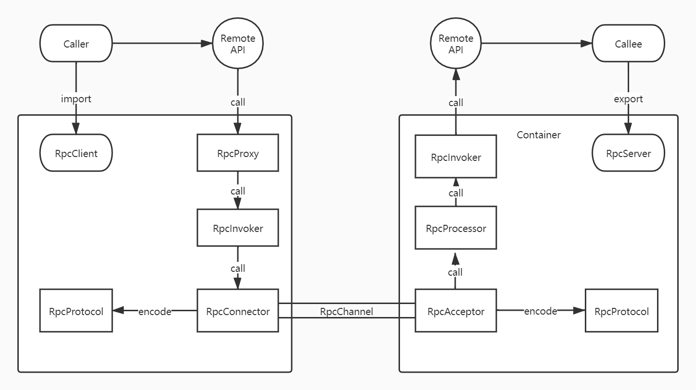

### 介绍

RPC(Remote Procedure Call 远程过程调用)它允许程序调用另一个地址空间（通常是共享网络的另一台机器上）的过程或函数，而不用程序员显式编码这个远程调用的细节。

RPC 是一种协议规范,RPC 服务的自动化程度比较高，能够实现强大的服务治理功能，和语言结合更友好，性能也十分优秀。

### RPC结构

该结构图包括了微服务之间在分布式环境下交互时所需的各个基本功能组件

RPC架构由左右两大部分构成，分别代表一个远程过程调用的客户端和服务端组件。

客户端组件的职责如下：
* RpcClient,负责导入由RpcProxy提供的远程接口的代理实现
* RpcProxy，远程接口的代理实现，提供远程服务本地化访问的入口
* RpcInvoker，负责编码和发送调用请求到服务方并等待结果
* RpcProtocol，负责网络传输协议的编码和解码
* RpcConnector，负责维持客户端和服务端连接通道和发送数据到服务端
* RpcChannel,网络传输通道

服务端组件和职责如下：
* RpcServer，负责导出远程接口
* RpcInvoker，负责调用服务端接口的具体实现并返回结果
* RpcProtocol,负责网络传输协议的编码和解码
* RpcAcceptor,负责接收客户方请求并返回请求结果
* RpcProcessor,负责在服务方控制调用过程，包括管理调用线程池，超时时间
* RpcChannel,网络数据传输通道
  
### REST
REST(Representational State Transfer)表述形状态转移，REST代表的不是一种技术，也不是一种标准和规范，而是一种风格。
就是用URL定位资源，用HTTP描述操作。

要理解RESTful架构，最好的方法就是去理解它的全称，Representational State Transfer直译过来就是表现层状态转移，其实他省略了主语。“表现层”指的是“资源”的“表现层”所以通俗来讲:*资源在网络中以某种表现形式进行状态转移*
* Resource  资源即数据
* Representational 表现形式如JSON，XML等
* State Transfer 状态转化 通过Http动词实现。

REST最重要的一条原则就是客户端和服务器之间的交互的*无状态性* 。从客户端到服务器的每个请求都必须包含理解该请求所必需的信息。在服务端，应用程序状态和功能可以分为各种资源。每个资源都适用URI得到唯一地址，所有资源都共享统一的接口，以便在客户端和服务器之间传输状态。在传输协议上使用标准HTTP方法。

比如
| URI                                    | HTTP方法 | 描述                   |
| -------------------------------------- | -------- | ---------------------- |
| http://www.example.com/users           | GET      | 获取User对象列表       |
| http://www.example.com/users/tianyalan | DELETE   | 根据用户名删除User对象 |

也就说能够看URI知道要什么，看Http方法知道干什么，看http status code就知道结果如何

### 序列化协议
所谓序列化就是将对象转化为字节数组，用于网络传输，数据持久化或者其他用途，反序列化则是把网络、磁盘等读取的数组还原成原始对象，以便后续业务逻辑操作。
序列化的方式有很多，常见的有文本和二进制两大类。XML和JSON是文本类序列化方式的代表，而二进制实现方案搬货Protocol Buffer和Thrift。

* Json和Pb的区别
1. Json更偏向于文本类编解码，Pb是二进制序列化方案，Pb效率更高，性能更好
2. 都是跨语言，Pb可以自定义数据结构，可拓展性强
3. 同样都简单易用，Pb可以自动化生成代码，但比较冗余
4. Json无版本检查需要自己做兼容，Pb解决了向后兼容问题