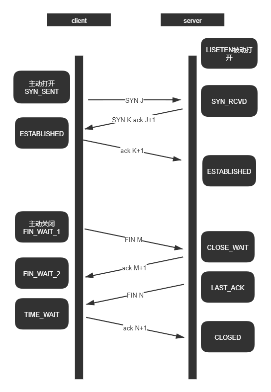

#### 介绍

* 提供面向连接的，可靠的字节流服务
* 为上层应用层提供服务，不关心具体传输的内容。

#### TCP与UDP的区别
* 基于连接和无连接
* 对系统资源的要求（TCP多，UDP少）
* 流模式与数据报模式
* 可靠性与不可靠性
* 顺序性与不保证顺序（系统接受IP数据报的速率超过这些数据报i处理的速率时，系统可能发送ICMP源站抑制差错报文，使用UDP时很容易产生这样的ICMP差错）

#### TCP如何保证可靠性

* 分块传送：数据被分割成最合适的数据块（UDP的数据报长度不变）
* 等待确认：通过定时器等待接收端发送确认请求，收不到确认则重发
* 确认回复：收到确认后发送确认回复(不是立即发送，通常推迟几分之一秒)
* 数据校验：保持首部和数据的校验和，检测数据传输过程有无变化
* 乱序排序：接收端能重排序数据，以正确的顺序交给应用端
* 重复丢弃：接收端能丢弃重复的数据包
* 流量缓冲：两端有固定大小的缓冲区（滑动窗口），防止速度不匹配丢数据

#### 建立 三次握手

客户端发送SYN，表明要向服务器建立连接。同时带上初始序号ISN

服务器返回包含服务器的初始序号的SYN报文段（SYN的序列号为服务端唯一的序号）作为应答。同时将确认序号ack设置为客户的ISN+1以对客户的SYN报文段进行确认。

客户端发送ACK确认收到回复（序列号为服务端序列号+1）

* 为什么需要三次握手
  
采用三次握手是为了防止失效的连接请求报文段突然又传送到主机B，因而产生错误。失效的连接请求报文段是指：主机A发出的连接请求没有收到主机B的确认，于是经过一段时间后，主机A又重新向主机B发送连接请求，且建立成功，顺序完成数据传输。考虑这样一种特殊情况，主机A第一次发送的连接请求并没有丢失，而是因为网络节点导致延迟达到主机B，主机B以为是主机A又发起的新连接，于是主机B同意连接，并向主机A发回确认，但是此时主机A根本不会理会，主机B就一直在等待主机A发送数据，导致主机B的资源浪费。

#### 四次挥手

主动关闭的一方发送FIN，表示要单方面关闭数据的传输

服务端收到FIN后，发送一个ACK作为确认（序列号为收到的序列号+1）

等服务器数据传输完毕，也发送一个FIN标识，表示关闭这个方向的数据传输

客户端回复ACK以确认回复

* 为什么要四次挥手

因为tcp协议的半关闭特性，tcp提供了字连接的一端关闭发送之后仍能接收另一端消息的能力，只有第二个FIN确认之后，这个连接才算关闭。

* 为什么要有半关闭？

没有半关闭当客户端需要通知服务端，已经完成了客户端数据传输但是仍然要接收服务端的数据，使用两个tcp连接可以是一个选择，但是采用半关闭会更好。

* 为什么需要TIME_WAIT（2MSL）等待?

每个具体的TCP实现必须选择一个报文段最大生存时间（MSL），它是任何报文段在被丢弃前在网络内存在的最大时间。
当TCP执行一个主动关闭时，最后一个ACK发回的时候，该链接必须在TIME_WAIT时间停留2MSL，这样可以让TCP再发送最后的ACK以防这个ACK丢失。
另一种结果是在这个2MSL时间等待内，定义这个连接的插口不能再被使用，这个连接只能在2MSL后再次被使用。

#### TCP状态

#### 超时重传

对于每一个连接TCP管理4个不同的定时器
* 重传定时器
  TCP重传定时器是TCP状态机的一部分，用来检查网络拥塞/数据丢失。当发出窗口中的第一个分段时，就需要安装一个重传定时器，超时时间为一个RTO。这确保TCP在分段发送后的RTO时间内收到ACK，如果没有得到确认，重传定时器就超时，据此判断出所有窗口中的数据都已丢失
* 坚持定时器 persist
  如果TCP一个确认丢失了，那么双方就可能因为等待对方而进入死锁状态，接收方等待接收数据，而发送等待允许他继续发送数据的窗口更新。为了防止这种情况的发生，发送发使用一个坚持定时器来周期性地向接收方查询，以便发现窗口是否增大。
* 保活定时器 keepalive
  连接中启动保活功能的一端，在保活时间内连接处于非活动状态，则向对方发送一个保活探测报文，如果收到响应，则重置保活计时器，如果没有收到响应报文，则经过一个保活时间间隔后再次向对方发送一个保活探测报文，如果还没有收到响应报文，则继续，直到发送次数到达保活探测数，此时，对方主机将被确认为不可到达，连接被中断。
* 2MSL定时器
TCP超时重传中最重要的部分就是对往返时间RTT的测量 RFC 793计算方法  R<-αR+(1-α)M

### 滑动窗口

滑动窗口以字节为单位。发送端有一个发送窗口，窗口重的序号是允许发送的序号，窗口的后沿是已经发送并且确认的序号，窗口的前沿是不允许发送的序号。窗口的后沿可能不动（代表没有收到新的确认），也有可能前移（代表收到了新的确认），但是不会后移（不可能撤销已经确认的数据）。窗口的前沿一般是向前的，也有可能不动（表示没有收到新的请求或对方的接收窗口变小），也有可能收缩，但是TCP强烈不建议这么做，因为发送端在收到通知前可能已经发送了很多数据，此时如果收缩窗口可能会产生错误。

滑动窗口的状态需要3个指针p1，p2和p3。p1之前的序号表示已经发送并且确认的，p1到p2的序号表示已经发送但还没有确认的，p2到p3表示允许发送的序号，也叫可用窗口，p1到p3表示发送窗口，p3之后的序号表示不可发送的。

发送缓存用来暂时存放发送应用程序传给发送方TCP准备发送的数据和已经发送但还没确认的数据。

接收缓存用来暂时存放按序到达的但尚未被应用程序读取的数据，未按序到达的数据。

注意三点：①发送窗口根据接收窗口设置，但并不总是一样大，还要根据网络的拥塞情况调整。②对于不按序到达的数据，TCP通常存放在接收窗口，等到字节流缺少的字节收到后再按序交付上层应用程序。③接收方必须有累积确认功能，可以减小传输开销，可以在合适的时候发送确认，也可以在自己有数据需要发送时捎带确认。但是接收方不能过分推迟发送确认，不能超过0.5秒。

##### 拥塞避免

* 慢启动、拥塞避免算法
  
  拥塞避免算法和慢启动算法需要对每个连接维持两个变量：一个拥塞窗口cwnd 和一个慢启动门限ssthresh
  过程：
  1. 对于一个给定的连接，初始化cwnd为1个报文段，ssthresh为65535个字节
  2. TCP输出例程的输出不能超过cwnd和接收方通告窗口的大小。拥塞避免是发送方使用的流量控制，通告窗口是接收方使用的流量控制。前者是发送方感受到的网络拥塞的估计，后者是在接收方在该连接上的可用缓存的大小有关。
  3. 当拥塞发生时（超时或者收到重复确认），ssthresh被设置为当前窗口的大小的一半。此外如果是超时引起了拥塞，则cwnd被设置为1个报文段（慢启动）
  4. 当新的数据被对方确认时，就增加cwnd，但增加的方法依赖于我们是否正在进行慢启动或拥塞避免。如果cwnd小于或等于ssthresh，则正在进行慢启动，否则正在进行拥塞避免。慢启动一直持续到我们回到拥塞发生时所处位置的半时候才停止，然后转为拥塞避免
  
  慢启动：指数级增长；拥塞避免：加性增长

* 快速重传 、快速恢复算法
  
  在收到一个失序的报文段时，TCP立即需要产生一个ACK。这个重复的ACK不应被延时，目的在于让对方知道收到了一个失序的报文段，并告诉对方自己希望收到的序号
  过程：
  1. 当收到第3个重复的ACK时，将ssthresh设置为当前cwnd的一半。重传丢失的报文段，设置cwnd为ssthresh加上3倍的报文段大小
  2. 每次收到另一个重复的ACK时，cwnd增加一个报文段大小并发送1个分组（如果新的cwnd允许发送）
  3. 当下一个确认新数据的ACK到达时，设置cwnd为ssthresh。这个ACK应该时进行重传后的一个RTT内对步骤1中重传的确认。另外，这个ACK也应该是对丢失的分组和收到的第一个重复的ACK之间的所有中间报文段的确认。这一步采用的时拥塞避免，因为当分组丢失时我们将当前的速率减半。

#### TCP KeepAlive 

基本原理是，隔一段时间给连接对端发送一个探测包，如果收到对方回应的 ACK，则认为连接还是存活的，在超过一定重试次数之后还是没有收到对方的回应，则丢弃该 TCP 连接。

#### TCP粘包和拆包

粘包产生的原因：操作系统在发送TCP数据的时候，底层会有一个缓冲区，例如1024个字节大小，如果一次请求发送的数据量比较小，没达到缓冲区大小，TCP则会将多个请求合并为同一个请求进行发送，这就形成了粘包问题；如果一次请求发送的数据量比较大，超过了缓冲区大小，TCP就会将其拆分为多次发送，这就是拆包，也就是将一个大的包拆分为多个小包进行发送

处理问题：
（1）发送方

对于发送方造成的粘包问题，可以通过关闭Nagle算法来解决，使用TCP_NODELAY选项来关闭算法。

（2）接收方

接收方没有办法来处理粘包现象，只能将问题交给应用层来处理。

（2）应用层

应用层的解决办法简单可行，不仅能解决接收方的粘包问题，还可以解决发送方的粘包问题。

解决办法：循环处理，应用程序从接收缓存中读取分组时，读完一条数据，就应该循环读取下一条数据，直到所有数据都被处理完成，但是如何判断每条数据的长度呢？

格式化数据：每条数据有固定的格式（开始符，结束符），这种方法简单易行，但是选择开始符和结束符时一定要确保每条数据的内部不包含开始符和结束符。
发送长度：发送每条数据时，将数据的长度一并发送，例如规定数据的前4位是数据的长度，应用层在处理时可以根据长度来判断每个分组的开始和结束位置。
